<!-- 1. HERO BANNER SVG -->

<!-- <h1 align="center">Hi, I'm Shree Varaa Mangai V 👋</h1>
<h3 align="center">ML/AI Engineer · Full-Stack Developer · MS in Artificial Intelligence Systems, University of Florida</h3> -->


<p align="center">
  
</p>

<!-- ---
### 🎯 What I'm Looking For
I am actively seeking **Entry-Level / Associate** roles starting immediately in:
* **Forward Deployed AI Engineer**
* **AI/ML Engineer**
* **Computer Vision Engineer**
* **Evaluation / Benchmark Engineer**
*  **Software Engineering** -->


<p align="center">
  <a href="mailto:shreevaraamangai@gmail.com"></a>
  <a href="YOUR_LINKEDIN_URL"></a>
 <a href="https://shreevm.github.io/Portfolio/"></a>

  
</p>


*📧 Feel free to reach out via [Email](mailto:shreevaraamangai@gmail.com) or connect on [LinkedIn](https://www.linkedin.com/in/shreevaraamangai/) if you have opportunities or want to collaborate!*

---

<!-- ### About Me

I'm a recent graduate with an **MS in Artificial Intelligence Systems** from the University of Florida (GPA 3.90/4.0), working across Agentic AI systems, fine-tuning LLMs, generative 3D reconstruction, LLM evaluation, and agentic RAG systems. My background spans production-grade ML pipelines, full-stack engineering, and applied research on trustworthy AI

- 🔭 Built a real-time 3D asset reconstruction pipeline (2D Gaussian Splatting) at **AGIS Inc.**
- 🔬 Researching hallucination detection in text-to-video models at UF's **Trustworthy Engineered Autonomy Lab**
- 🌱 Exploring agentic RAG, multi-agent systems, and MCP-based tool orchestration
- 🎓 B.Tech in Information Technology, Loyola-ICAM College of Engineering and Technology (GPA 8.43/10)
- 📫 Reach me at **shreevaraamangai@gmail.com** -->


### Engineering Stack

**ML / LLM & AI**
<p>


</p>

**Full-Stack Engineering**
<p>


</p>

**Databases & Cloud**
<p>


</p>

**Data & Visualization**
<p>


</p>

---

# Featured Projects

### 🩺 CareMind: Agentic Clinical RAG Assistant
📅 May 2026 – Jun 2026 | 🔗 [GitHub](https://github.com/shreevm/CareMind/tree/new_CareMind)

```bash
[Problem]
Enable clinicians to retrieve, compare, and reason over
large medical documents through a single intelligent interface.

[Solution]
✓ Built an Agentic RAG platform using LangGraph.
✓ Designed multi-agent workflows for document retrieval,
  report comparison, and medical education.
✓ Developed a custom MCP server supporting document search,
  timeline extraction, and citation-aware responses.
✓ Optimized query latency using Redis caching and
  NVIDIA NIM embeddings.

[Highlights]
✓ Multi-agent clinical reasoning workflow
✓ Citation-aware semantic retrieval
✓ Reduced redundant document retrieval through caching
✓ Production-ready full-stack web application

[Tech]
Python | FastAPI | LangGraph | MCP | NVIDIA NIM |
Redis | Supabase | React | TypeScript
```

---

### 🧠 Multi-Image Super Resolution for Prostate MRI
📅 Nov 2025 – Dec 2025 | 🔗 [GitHub](https://github.com/shreevm/MRI_Slice-SuperResolution)

```bash
[Problem]
Reconstruct missing prostate MRI slices while preserving
clinical-grade anatomical consistency.

[Solution]
✓ Developed CNN, SRGAN, and Diffusion-based
  super-resolution pipelines.
✓ Trained and evaluated models on 40,532 MRI slice pairs.
✓ Benchmarked architectures using PSNR, SSIM, and
  qualitative anatomical assessment.

[Highlights]
✓ SRGAN achieved the highest reconstruction accuracy
  (29.05 dB PSNR, 0.850 SSIM).
✓ Diffusion models produced the strongest anatomical
  continuity despite higher inference latency.
✓ Quantified fidelity vs. perceptual realism trade-offs.

[Tech]
PyTorch | CNN | SRGAN | Diffusion Models |
OpenCV | NumPy
```

---

### 🎙 Multimodal Spoken Command Recognition
📅 Oct 2025 – Nov 2025 | 🔗 [GitHub](https://github.com/shreevm/Multimodal-Spoken-Command-Recognition-with-Audio-Text-Fusion-and-Vector-Retrieval)

```bash
[Problem]
Improve spoken command recognition in noisy,
real-world environments.

[Solution]
✓ Combined Wav2Vec2 audio embeddings with BERT
  semantic embeddings through cross-attention.
✓ Designed a Transformer-based multimodal
  fusion architecture.
✓ Integrated Pinecone vector retrieval to
  improve inference robustness.

[Highlights]
✓ Improved semantic understanding of spoken commands
✓ Increased robustness under noisy conditions
✓ Demonstrated the effectiveness of multimodal fusion

[Tech]
PyTorch | Hugging Face | Wav2Vec2 | BERT |
Transformer | Pinecone | Scikit-learn
```

---

### 📚 CognitoMap: Bloom's Taxonomy Classifier
📅 Feb 2024 – Apr 2024 | 🔗 [GitHub](https://github.com/shreevm/Cognitomap)

```bash
[Problem]
Help educators automatically analyse the cognitive
distribution of assessment questions.

[Solution]
✓ Built an ETL pipeline extracting questions from PDFs.
✓ Achieved 94% extraction accuracy using Gemini.
✓ Classified questions using Sentence Transformer
  embeddings and Pinecone retrieval.
✓ Developed a full-stack analytics dashboard.

[Highlights]
✓ 94% PDF extraction accuracy
✓ Automated Bloom's Taxonomy classification
✓ Real-time educator analytics dashboard

[Tech]
Python | Flask | React | MongoDB |
Pinecone | Gemini API | Chart.js | TypeScript
```
---

# WORK & RESEARCH Experience

### ML Engineering Co-op | AGIS Inc. × University of Florida (IPPD)
📍 Gainesville, FL | Aug 2025 – Apr 2026

```bash
[Challenge]
Build an end-to-end pipeline that converts images/videos into
high-fidelity, Unity-ready 3D assets.

[Action]
✓ Led the 2D Gaussian Splatting (2DGS) reconstruction stage.
✓ Integrated SAM2 zero-shot segmentation, COLMAP/GLOMAP,
  mesh generation, UV unwrapping, and Unity export.
✓ Accelerated reconstruction on NVIDIA B200 GPU clusters
  using CUDA nightly builds.

[Impact]
✓ 32.72 dB PSNR (target >30 dB)
✓ 0.942 mean IoU (target ≥0.85)
✓ Reduced meshes from 4.99M → 1M triangles
✓ 94.18% valid texture coverage
✓ 77.8% Gaussian retention after filtering
✓ Delivered Unity-ready assets in 8 minutes
✓ 47% faster than Kiri Engine

[Tech]
Python | PyTorch | CUDA | 2DGS | SAM2 |
COLMAP | GLOMAP | Open3D | Unity
```

---

### Machine Learning Researcher | Trustworthy Engineered Autonomy Lab
📍 Gainesville, FL | Sep 2025 – Present

```bash
[Research Goal]
Develop reliable methods to benchmark and detect
hallucinations in text-to-video generative models.

[Research]
✓ Generated and annotated 15,000+ videos using Wan 2.1
  and HunyuanVideo across T2VCompBench and ViBe.
✓ Developed a fine-grained hallucination taxonomy covering
  object, attribute, spatial, and semantic inconsistencies.
✓ Benchmarking Qwen3-VL against 12+ VLM baselines for
  hallucination detection and severity classification.
✓ Investigating robust evaluation methodologies for
  multimodal generative AI.

[Current Findings]
✓ Qwen3-VL currently leads all evaluated baselines on
  T2VCompBench/Wan 2.1.
✓ +6.5 point Balanced Accuracy over the strongest baseline.
✓ Ongoing evaluation across additional datasets and models.

[Tech]
Python | PyTorch | vLLM | Qwen3-VL |
Wan 2.1 | HunyuanVideo | T2VCompBench
```

---

### Global People Analytics Intern | Ford Motor Company
📍 Chennai, India | Aug 2023 – Oct 2023

```bash
[Challenge]
Improve workforce planning and salary forecasting using
large-scale employee analytics.

[Action]
✓ Built forecasting models using ARIMA, VAR, VECM,
  Lasso, and Ridge regression.
✓ Developed Python ETL pipelines for 1,000+
  workforce records.
✓ Performed feature engineering and exploratory
  data analysis to improve model performance.

[Impact]
✓ Improved prediction accuracy by 20%
✓ Automated salary cost forecasting
✓ Supported data-driven workforce planning

[Tech]
Python | Pandas | Statsmodels |
Scikit-learn | SQL
```

---

### Software Engineer Intern | Spacescan Ltd.
📍 Remote (Ontario, Canada) | Sep 2022 – Jan 2023

```bash
[Challenge]
Build scalable web and mobile applications with
maintainable frontend architecture.

[Action]
✓ Developed reusable React.js components.
✓ Integrated Swagger-documented REST APIs with PostgreSQL.
✓ Extended the React Native mobile application and
  contributed to frontend architecture decisions.

[Impact]
✓ Reduced code duplication
✓ Improved frontend maintainability
✓ Delivered a consistent cross-platform user experience

[Tech]
React | React Native | TypeScript |
PostgreSQL | Swagger
```

---


---


### Certifications

- Building with the Claude API - Anthropic (July 2026)
- Build and Orchestrate Agents with Microsoft Foundry - Microsoft AI Skills Challenge (Jun 2026)
- Fundamentals of Deep Learning - NVIDIA (Nov 2024)
- Fine-Tuning LLMs for Cybersecurity (Mistral, Llama, AutoTrain, AutoGen, LLM Agents) - LinkedIn Learning (Jan 2025)
- Tesla Stock Price Prediction & Google Cloud Fundamentals - Coursera (Dec 2023 / Aug 2022)
- Cloud Computing & Distributed Systems; Java Programming - NPTEL (Mar 2021 / Oct 2021)

-
---

### 📈 GitHub Stats

<p align="center">
  
  
</p>
<p align="center">
  
</p>

---
### 🤝 Let's Connect

<p>
  <a href="mailto:shreevaraamangai@gmail.com"></a>
  <a href="YOUR_LINKEDIN_URL"></a>
  <a href="https://medium.com/@shreevaraamangai"></a>
</p>

---


 \> Design intelligent systems that make sense and make a difference!

